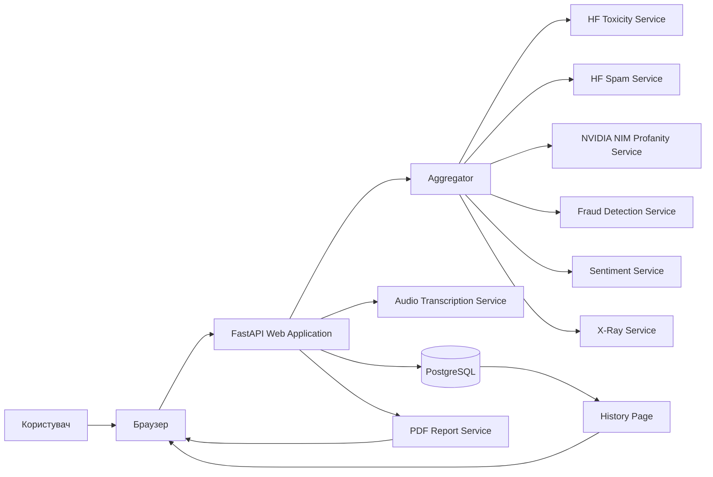
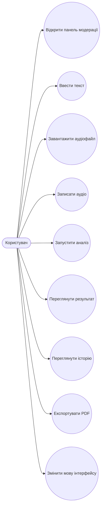
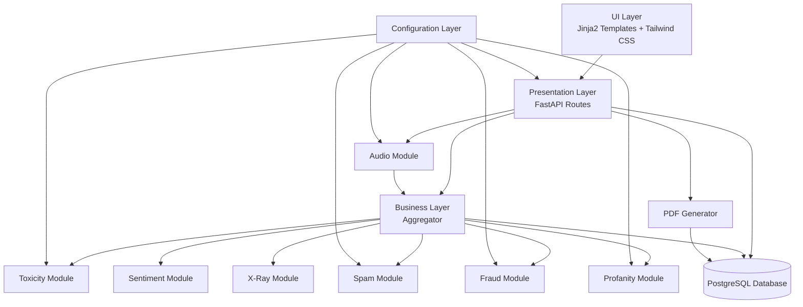
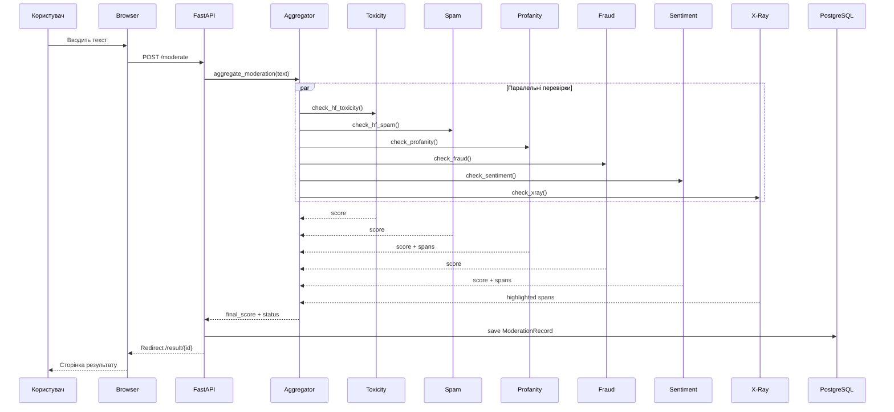
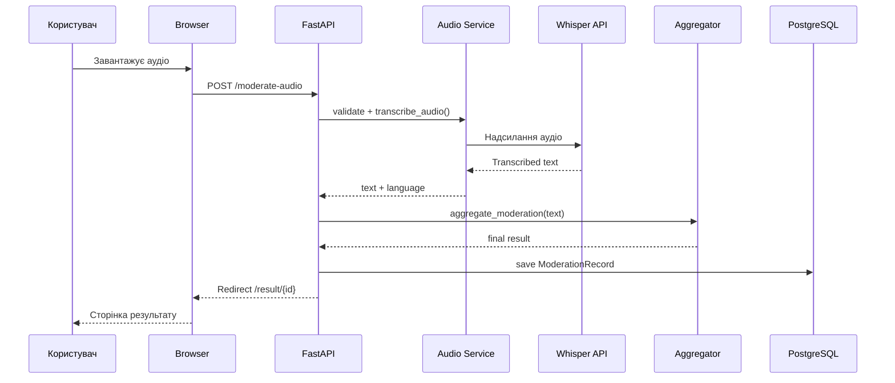
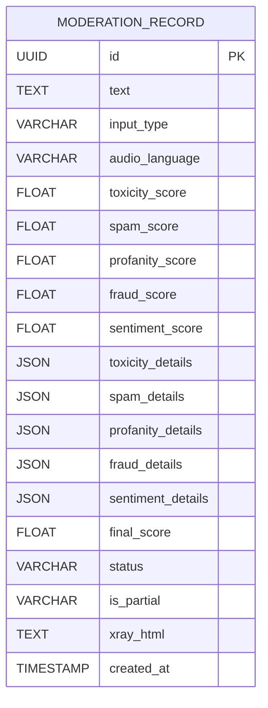
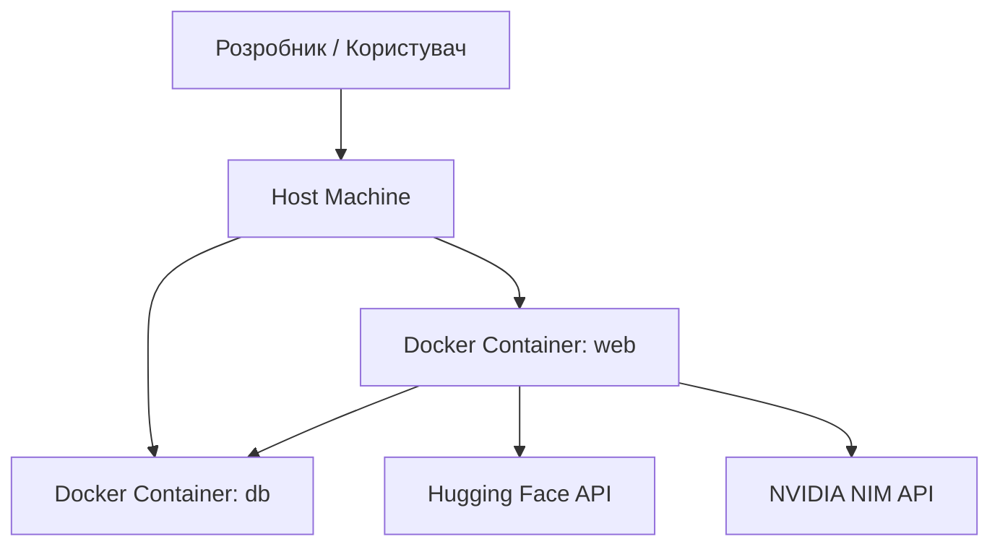
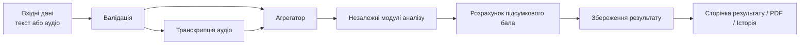

# DIAGRAMS

## 1. Загальна архітектура системи

## 2. Use Case діаграма

## 3. Діаграма компонентів

## 4. Діаграма послідовності для текстового аналізу

## 5. Діаграма послідовності для аудіоаналізу

## 6. ER-діаграма

## 7. Діаграма розгортання

## 8. Діаграма потоків даних

## Примітка

Якщо потрібно, наступним кроком можна:

1. конвертувати ці Mermaid-діаграми в SVG або PNG;
2. вставити їх посиланнями прямо в `DIPLOMA.md`;
3. підготувати окремий варіант діаграм у стилі UML для draw.io.
